# Core sample analysis using Machine Learning and Neural Network models
This project analyzes the raw images of core samples.  Because the Jupyter Notebook can be hard to load sometimes, here is a Markdown exported from the Notebook.  You can also view the [original Jupyter Notebook here](../core_sample.ipynb)

```python
import numpy as np
import os
from sklearn.cluster import KMeans
from sklearn.cluster import MiniBatchKMeans
import matplotlib.pyplot as plt
from matplotlib.pyplot import imread, imshow
import cv2
from sklearn.cluster import KMeans
from sklearn.metrics import silhouette_score
import time

plt.rcParams.update({
    'font.size': 14, 
    'lines.linewidth':4, 
    "figure.figsize": (16, 10)
})
```


```python
pics = [
    'CG-IS-001 Box 09-10 (24.65 to 29.50)split.png',
    'CG-IS-005 Box 03-04 (5.40 to 11.30)split.png',
    'CH-IU-013 Box 01-02 (0.00 to 5.60)split.png'
]
```

## Examine the specs of the image


```python
t0 = time.time()
```


```python
def checkImgs(name, path = 'imgs'):
    img = imread(os.path.join(path, name))
    plt.figure(figsize = (80, 10))
    plt.imshow(img)
    plt.show()
    print(f'shape of {name} = {img.shape}, max = {img.max()}, min = {img.min()}')
```


```python
for pic in pics:
    checkImgs(pic)
```


    
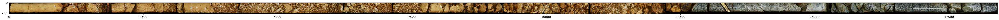
    


    shape of CG-IS-001 Box 09-10 (24.65 to 29.50)split.png = (221, 18402, 3), max = 1.0, min = 0.0


    
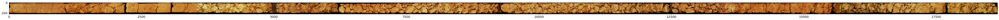
    


    shape of CG-IS-005 Box 03-04 (5.40 to 11.30)split.png = (220, 18653, 3), max = 1.0, min = 0.0


    
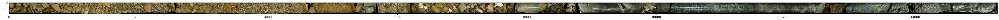
    


    shape of CH-IU-013 Box 01-02 (0.00 to 5.60)split.png = (185, 15272, 3), max = 1.0, min = 0.0


### Make sure color sequence is R -> G -> B


```python
img1 = imread(os.path.join('imgs', pics[0]))
img1_head = img1[:, :400, :].copy()
img1_head[:, :10, 0] = 1.0
img1_head[:, 20:30, 1] = 1.0
img1_head[:, 40:50, 2] = 1.0
imshow(img1_head)
del img1
```


    
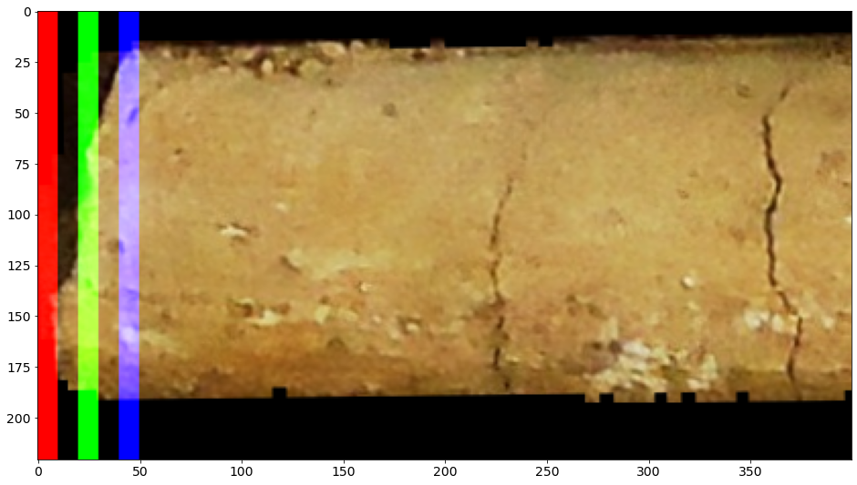
    


## Analyze color channels in the image
As the format of the images are examined, we can then compare the RGB ingredient in the images, which is similar to how human eyes compare different objects.


```python
def colorIntensity(vals, title = '', ylabel = ''):
    color_map = {0: 'r', 1: 'g', 2: 'b'}
    y_lim = (0, 1)
    fig = plt.figure(figsize = (80, 15))
    plt.ylim(y_lim)
    plt.ylabel(ylabel)
    plt.grid(True)
    for i in range(vals.shape[1]):
        plt.plot(vals[:, i], c = color_map[i])
    plt.title(title, fontsize = 40)
    plt.show()
```

The subplotting version of above feature:
```python
def colorIntensity(vals, title):
    color_map = {0: 'r', 1: 'g', 2: 'b'}
    y_lim = (0, 1)
    fig = plt.figure(figsize = (80, 10))
    fig.title(title)
    for i in range(vals.shape[1]):
        ax = fig.add_subplot(3, 1, i+1)
        ax.plot(vals[:, i], c = color_map[i])
        ax.set_ylim(y_lim)
        ax.grid(True)
    plt.show()
```


```python
class ImageInfo():
    def __init__(self, ch_abs, ch_rel, valid_pxls):
        assert ch_abs.shape[0] == ch_rel.shape[0] == len(valid_pxls), \
            "Mismatched array dimensions"
        self.ch_abs = ch_abs
        self.ch_rel = ch_rel
        self.valid_pxls = valid_pxls
    def __repr__(self):
        return f"ImageInfo: ch_abs shape = {self.ch_abs.shape}, ch_rel shape = {self.ch_rel.shape}, {len(self.valid_pxls)}"
```


```python
def showChannels(inp):
    h, w, c = inp.shape
    channel_absolute = np.empty((0, c), float)
    channel_relative = np.empty((0, c), float)
    ranges = list()
    outline = np.zeros((h, w))
    for i in range(w):
        col_slice = inp[:, i, :]
        all_color = col_slice.sum(axis = 1)
        min_step = 1 / 255
        valid_range = np.argwhere(all_color >= min_step).ravel()
#         valid_idx = np.argwhere(all_color >= min_step).ravel()
#         valid_range = range(valid_idx[0], valid_idx[-1] + 1)
        ranges.append(valid_range)
        outline[valid_range, i] = min_step * 100
        p = np.average(col_slice[valid_range], axis = 0)
        channel_absolute = np.vstack((channel_absolute, p))
        rel = p / np.sum(p)
        channel_relative = np.vstack((channel_relative, rel))
#     plt.figure(figsize = (80, 10))
#     plt.title('valid area', fontsize = 50)
#     imshow(outline, cmap = 'gray')
#     plt.show()
    fig = plt.figure(1, figsize = (16, 8))
    plt.subplot(121)
    plt.imshow(inp[:, :400, :])
    plt.title('original image')
    plt.subplot(122)
    plt.imshow(outline[:, :400], cmap = 'viridis')
    plt.title('valid area')
    plt.show()
    colorIntensity(channel_absolute, 'Individual Brightness', '')
    colorIntensity(channel_relative, 'Relative Brightness', '%')
    print('\n\n')
    del inp, outline
    return ImageInfo(channel_absolute, channel_relative, ranges)
```


```python
def analyzeImg(png_name):
    img = imread(os.path.join('imgs', png_name))
    plt.figure(figsize = (80, 10))
    plt.title(png_name, fontsize = 100)
    imshow(img)
    plt.show()
    return showChannels(img)
```


```python
img_info = list()
for pic in pics:
    info = analyzeImg(pic)
    img_info.append(info)
```


    
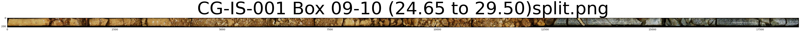
    


    
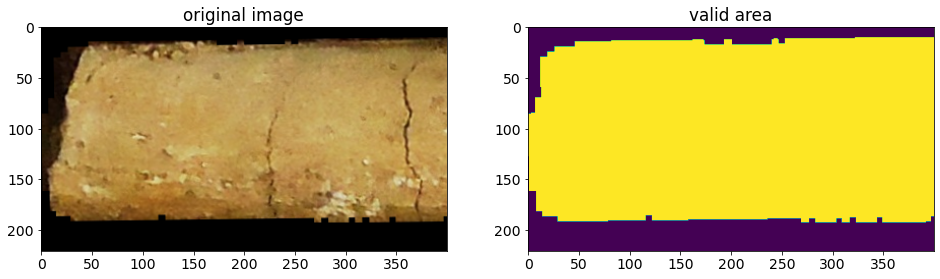
    


    
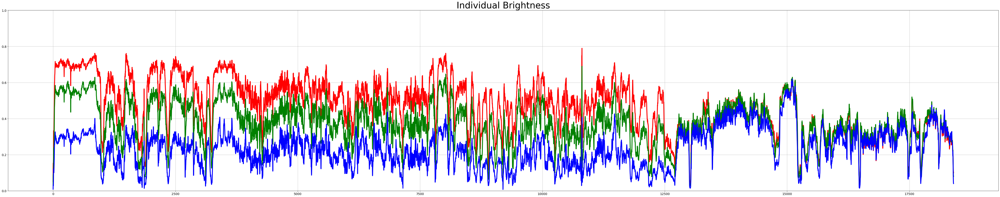
    


    
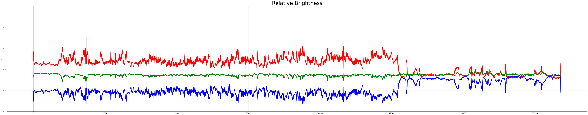
    


    
    
    


    
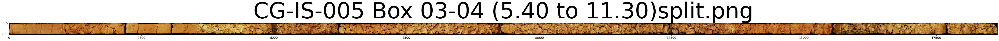
    


    
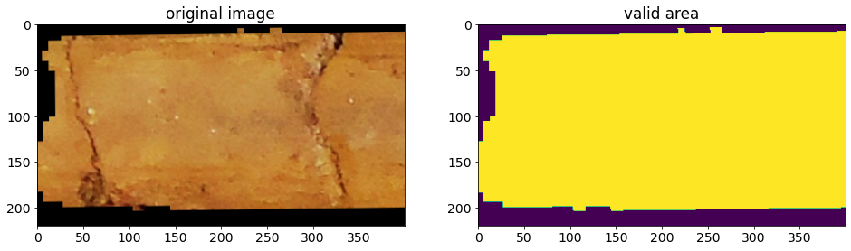
    


    
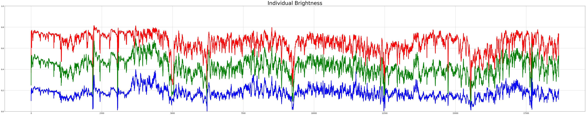
    


    
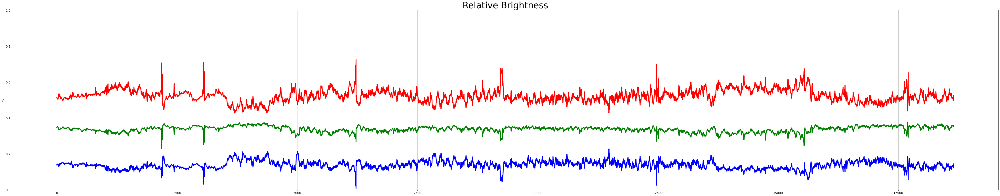
    


    
    
    


    
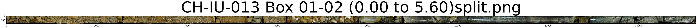
    


    
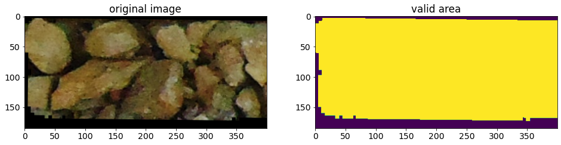
    


    
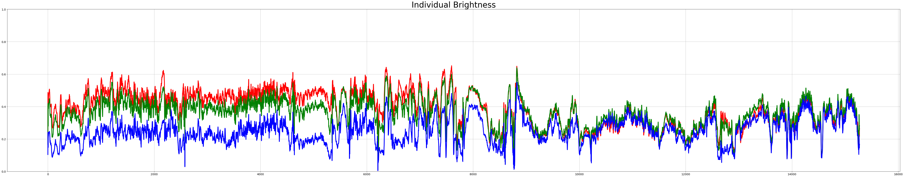
    


    
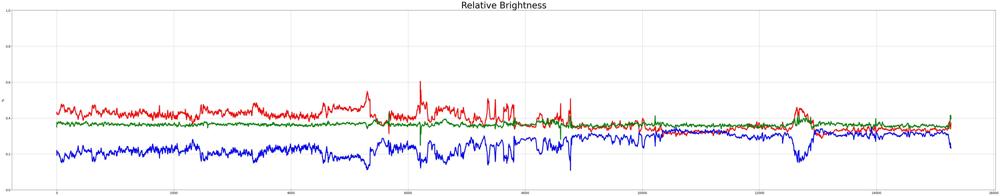
    


    
    
    


```python
print(f'It takes {time.time() - t0:.3f} seconds to get here')
```

    It takes 11.572 seconds to get here


### Observation from RGB analysis
After looking into the RGB component of the core samples, I think here we have 3 different types of rocks:
- sample_1 seems to consist of 2 distinct portions, and the junction divides the sample into 70% and 30% of the total length  
- rock type of sample_2 seems homogeneous, and it's very similar to the first 70% of sample_1
- sample_3 also consists of 2 distinct portions, and the juction divides the sample into 60% and 40% of the total length.  sample_3's tailing 40% seems having a composition very similar to sample_1's tailing 30%.


```python
for i, info in enumerate(img_info):
    colorIntensity(info.ch_rel, title = f'core sample -{i + 1}')
```


    
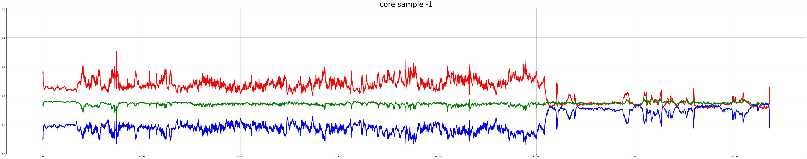
    


    
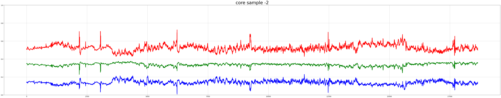
    


    
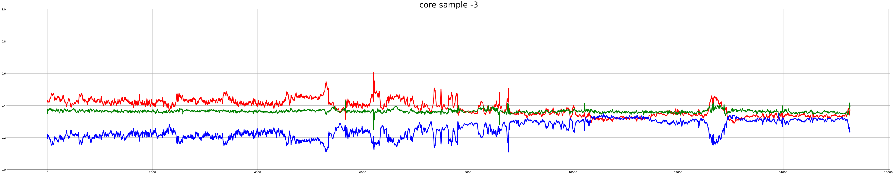
    


## Including Texture and Shape
As the RGB component of the samples has been analyzed, we can know also include the texture into the formula.  To achieve this, my thought is to feed the images to a pre-trained CNN model without the top layer for feature extraction.  After that, we can use clustering algorithms to group similar sample portions together.


```python
import tensorflow as tf
from tensorflow.keras.layers import Dense, Flatten, Conv1D, MaxPooling1D, Conv2D, MaxPooling2D
from tensorflow.keras.models import Sequential, Model
from tensorflow.keras.preprocessing import image
from tensorflow.keras.applications.resnet50 import ResNet50, preprocess_input
```


```python
# Make sure GPU can be used by TensorFlow
gpus = tf.config.experimental.list_physical_devices('GPU')
print(gpus)
assert len(gpus) > 0, \
    "Not enough GPU hardware devices available"
config = tf.config.experimental.set_memory_growth(gpus[0], True)
# tf.config.gpu.set_per_process_memory_fraction(0.8)
# tf.config.gpu.set_per_process_memory_growth(True)
```

    [PhysicalDevice(name='/physical_device:GPU:0', device_type='GPU')]


#### Extract sub-samples from core images
Because the original image is very wide, I will divide each image into several sections and extract one sub-image from each section.  For now, I will use 20 sections for every image.

According to https://keras.io/api/applications/resnet/#resnet50-function, the smallest input width/height for ResNet50 is 32.  Here I try to extract from the sample 4 times of this on each dimension, which is a 128x128 for each example.


```python
def getSubs(img, n, area):
    H, W, C = img.shape
    init, end = int(W * 0.01), int(W * 0.99)
    grids = np.linspace(init, end, n+1).astype(int)
    secs = list()
    for i, idx in enumerate(grids[:-1]):
        offset = idx
        top, btm = 0, H - 1
        for j in range(idx, grids[i + 1]):
            vld = area[j]
            h0, h1 = vld[0], vld[-1]
            top = h0 if h0 > top else top
            btm = h1 if h1 < btm else btm
            height = h1 - h0 + 1
            if height != len(vld) or height < int(magic * 1.1):
                offset = j
                top, btm = 0, H - 1
            if j - offset == magic:
                break
        gap = (btm - top + 1 - magic) // 2
        top_adj, btm_adj = top + gap, top + gap + magic
        secs.append((top_adj, btm_adj, offset, j))
    return secs
```


```python
%%capture
from PIL import Image
import imageio

magic = 128
num_sections = 20
if not os.path.exists('data'):
    os.mkdir('data')
for img_n, path in enumerate(pics):
    img = imread(os.path.join('imgs', path))
    valid_area = img_info[img_n].valid_pxls
    secs = getSubs(img, num_sections, valid_area)
    for i, (i0, i1, j0, j1) in enumerate(secs):
        mtx = img[i0:i1, j0:j1, :]
        assert mtx.shape[2] == 3, f'{img_n}, {i}, {mtx.shape}'
        imageio.imwrite(os.path.join('data', f'img{img_n+1}_{i+1:02}.png'), mtx)
#         r, g, b = cv2.split(mtx)
#         mtx = cv2.merge([b, g, r])
#         mtx = (mtx / mtx.max() * 255).astype(int)
#         cv2.imwrite(os.path.join('data', f'img{img_n+1}_{i+1:02}.png'), mtx)
#         plt.imsave(os.path.join('data', f'img{img_n+1}_{i+1:02}.png'), mtx)
```


```python
rand_ex = np.random.choice(os.listdir('data'), size = 3, replace = False)
iis = [imread(os.path.join('data', name)) for name in rand_ex]
print(list(map(lambda x: x.shape, iis)))
```

    [(128, 128, 3), (128, 128, 3), (128, 128, 3)]


```python
def showImgs(imgs, title):
    cols = len(imgs)
    fig, ax = plt.subplots(nrows = 1, ncols = cols)
    fig.suptitle(title, fontsize = 16, verticalalignment = 'bottom', y = 0.8)
    for i, _ax in enumerate(ax.flat):
        _ax.imshow(imgs[i])
        subtitle = f'image {i + 1}'
        _ax.set_title(subtitle, fontsize = 13)
    fig.tight_layout()
    plt.show()
```


```python
showImgs(iis, '3 randomly picked Sub-samples')
```


    

    


```python
resnet50 = ResNet50(weights='imagenet', include_top = False)
```


```python
features, names = list(), list()
for filename in os.listdir('data'):
    img = imread(os.path.join('data', filename))
#     img = imread(os.path.join('data', filename))[:, :, :3]
    img_prep = preprocess_input(np.expand_dims(img, axis = 0))
    feat = resnet50.predict(img_prep)
    features.append(feat.flatten())
    names.append(filename)
```


```python
features = np.array(features)
print(features.shape)
clusters = list()
ks = list(range(2, 10))
for k in ks:
    kmeans = KMeans(n_clusters = k, random_state = 2021).fit(features)
    clusters.append(kmeans.labels_)
```

    (60, 32768)


```python
silhouette_resnet50 = list()
for cl in clusters:
    silhouette_resnet50.append(silhouette_score(features, cl))
silhouette_resnet50
```


    [0.3199781,
     0.27354655,
     0.16013347,
     0.10137114,
     0.09195847,
     0.10992125,
     0.0409289,
     0.10677484]


```python
print(f'To get here, it takes {time.time() - t0:.3f} seconds')
```

    To get here, it takes 34.456 seconds


### Observation from clustering with ResNet50
The result indicates that the examples should be put into 2 clusters, indicating that there should be only 2 kinds of rocks.  However, this doesn't match what I found from RGB analysis, which indicates 3 different types of rocks.  To further investigate this, I will incorporate different models for feature extraction. 

### Try different pre-trained models


```python
class FeatExtractor():
    def __init__(self, model, prep_func):
        self.model = model
        self.prep_func = prep_func
    def __repr__(self):
        return self.model.__name__
```


```python
import pandas as pd
from tensorflow.keras.applications.resnet50 import ResNet50, preprocess_input as resnet50_prep
from tensorflow.keras.applications.inception_v3 import InceptionV3, preprocess_input as inceptionv3_prep
from tensorflow.keras.applications.xception import Xception, preprocess_input as xception_prep
```


```python
models = [
    FeatExtractor(ResNet50, resnet50_prep),
    FeatExtractor(InceptionV3, inceptionv3_prep),
    FeatExtractor(Xception, xception_prep)
]
models
```


    [ResNet50, InceptionV3, Xception]


```python
def extractFeat(extractor, path):
    model = extractor.model(weights='imagenet', include_top = False)
    features, names = list(), list()
    for filename in os.listdir(path):
        img = imread(os.path.join(path, filename))
        img_prep = extractor.prep_func(np.expand_dims(img, axis = 0))
        feat = model.predict(img_prep)
        features.append(feat.flatten())
        names.append(filename)
    return np.array(features)
```


```python
def getSilhouette(model, path):
    features = extractFeat(model, path)
    clusters = list()
    for k in k_list:
        kmeans = KMeans(n_clusters = k, random_state = 2021).fit(features)
        clusters.append(kmeans.labels_)
    silhouette = list()
    for cl in clusters:
        silhouette.append(silhouette_score(features, cl))
    return silhouette
```


```python
k_list = list(range(2, 20))
df = pd.DataFrame({'k': k_list})
```


```python
for model in models:
    df[f'{model}_silhouette'] = getSilhouette(model, 'data')
```


```python
fig = plt.figure()
plt.plot(df['k'], df.iloc[:, 1:])
plt.legend(df.columns[1:])
plt.grid(True)
plt.ylabel('Silhouette Score')
plt.xlabel('k')
plt.xticks(df['k'].values)
plt.title('Silhouette Score vs k for Different Models')
plt.show()
```


    
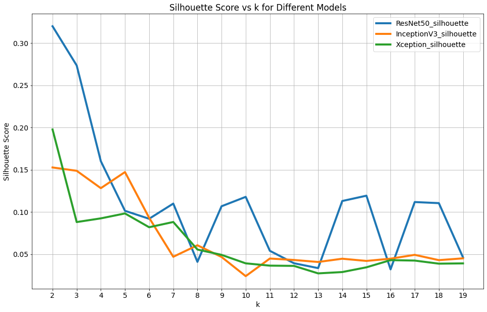
    


```python
print(f'In total, it takes {time.time() - t0:.3f} seconds')
```

    In total, it takes 117.811 seconds


### Enhance the picture quality of sub-samples
Because the randomly displayed examples are blurry, I tried to enhance the edges with 2D convolution and normalize the color intensity.


```python
def sharpen(image, kernel_size=(5, 5), sigma=1.0, amount=2.0, threshold=0):
    """Return a sharpened version of the image, using an unsharp mask."""
    blurred = cv2.GaussianBlur(image, kernel_size, sigma)
    sharpened = float(amount + 1) * image - float(amount) * blurred
    sharpened = np.maximum(sharpened, np.zeros(sharpened.shape))
    sharpened = np.minimum(sharpened, np.ones(sharpened.shape))
#     sharpened = (sharpened - np.min(sharpened)) / (np.max(sharpened) - np.min(sharpened))
    if threshold > 0:
        low_contrast_mask = np.absolute(image - blurred) < threshold
        np.copyto(sharpened, image, where=low_contrast_mask)
    return sharpened
```


```python
%%capture
import imageio
from scipy.signal import convolve2d

magic = 128
num_sections = 20
if not os.path.exists('data_enhanced'):
    os.mkdir('data_enhanced')
for img_n, path in enumerate(pics):
    img = imread(os.path.join('imgs', path))
    valid_area = img_info[img_n].valid_pxls
    secs = getSubs(img, num_sections, valid_area)
    for i, (i0, i1, j0, j1) in enumerate(secs):
        mtx = img[i0:i1, j0:j1, :]
        assert mtx.shape[2] == 3, f'{img_n}, {i}, {mtx.shape}'
        mtx_sharpened = np.zeros(mtx.shape) #sharpen(mtx)
        for ch in range(mtx.shape[2]):
            mtx_sharpened[:, :, ch] = sharpen(mtx[:, :, ch])
        imageio.imwrite(os.path.join('data_enhanced', f'img{img_n+1}_{i+1:02}.png'), mtx_sharpened)
```


```python
iis2 = [imread(os.path.join('data_enhanced', name)) for name in rand_ex]
print(list(map(lambda x: x.shape, iis2)))
```

    [(128, 128, 3), (128, 128, 3), (128, 128, 3)]


```python
showImgs(iis2, 'Edge Enhanced Sub-samples')
showImgs(iis, "Same images before enhancement")
```


    
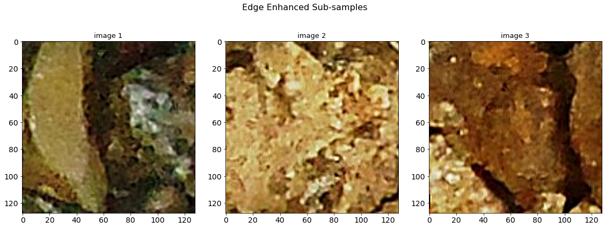
    


    
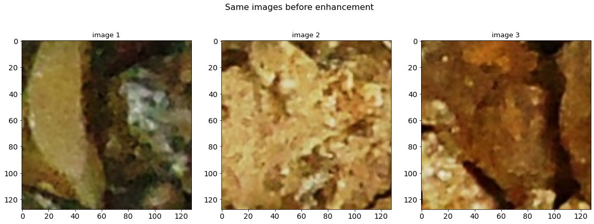
    


```python
df2 = pd.DataFrame({'k': k_list})
for model in models:
    df2[f'{model}_silhouette'] = getSilhouette(model, 'data_enhanced')
```


```python
fig = plt.figure()
plt.plot(df2['k'], df2.iloc[:, 1:])
plt.legend(df.columns[1:])
plt.grid(True)
plt.ylabel('Silhouette Score')
plt.xlabel('k')
plt.xticks(df2['k'].values)
plt.title('Silhouette Score vs k for Different Models (enhanced edge)')
plt.show()
```


    
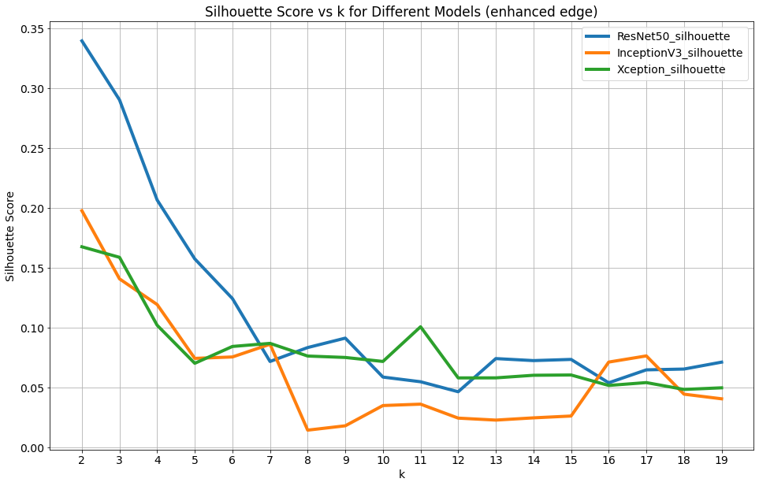
    


## Conclusion
After sharpening the sub-samples, it seems the combination of pre-trained models and KMeans all agree that there are 2 rock types in the 3 core samples.  Although this defies the result of RGB analysis, because CNN models take both color and shape into consideration, I have to go with the conclusion generated by CNN models.


```python

```
